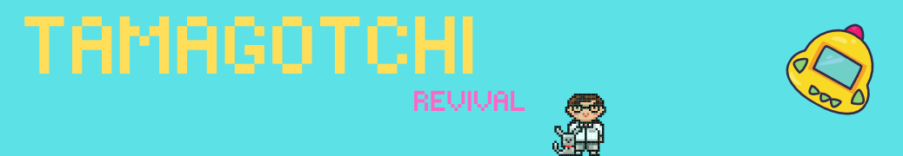

# :rainbow: Tamagotchi

Javascript, Parcel and CSS only

## :helicopter: Game features

1. Start game
2. Feed pet
3. Clean pet
4. Change weather

## :checkered_flag: Start project

```bash

npm run dev

```

## :bath: Source

- <a href="https://frontendmasters.com/"> :heart: FrontendMasters.com
- <a href="https://www.pickledalice.com/"> :fireworks: Art by Alice Brereton
